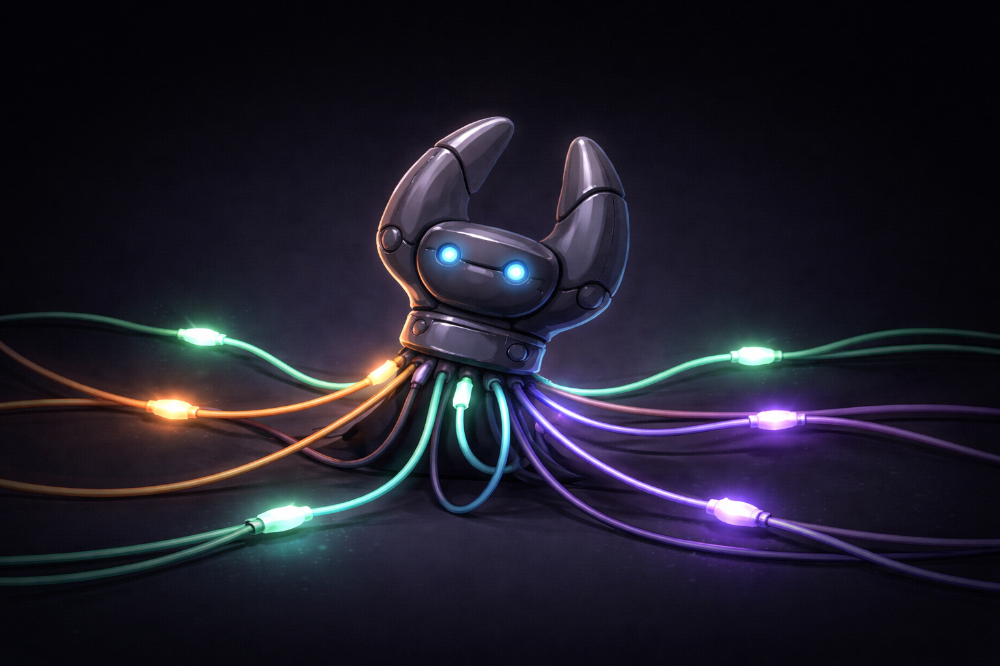

# monoclaw



Personal AI assistant with one continuous session, WebSocket-native multi-channel interaction, minimal codebase for clarity and security.

**codebase:** `2350 lines across 13 files (src/*.py, Dockerfile, pyproject.toml)`

---

- agent turn loop, tool base class + registry, file/shell tools, `CronService` — rewritten in Python based on [NanoClaw](https://github.com/qwibitai/nanoclaw)
- structured memory with hybrid search, tiered compaction — inspired by [free-code](https://github.com/paoloanzn/free-code) and [OpenClaw](https://github.com/openclaw/openclaw)
- massive open-source codebase, unreviewed community contributions, security vulnerabilities nobody can trace — graciously avoided thanks to [OpenClaw](https://github.com/openclaw/openclaw)


## specific features

- **Single continuous session** — one history shared across all channels and time. The agent is coherent and persistent like a human, not stateless.
- **WebSocket-only protocol** — monoclaw speaks one protocol. Bridges (Signal, Telegram, web UI, etc.) are separate applications that connect over WebSocket and declare their name on handshake.
- **Agent-selectable output channel** — the agent can inspect active channels and redirect its reply mid-turn using tools. Default: reply to the inbound channel.
- **Structured long-term memory** — typed memories (user/project/reference/feedback) stored as individual Markdown files with SQLite FTS5 index. Hybrid keyword + vector search with temporal decay and MMR diversity re-ranking. Agent searches its own memory via tools.
- **Automatic post-turn extraction** — after each response, the LLM extracts memorable facts and saves them with embeddings. Existing memories are updated, not duplicated.
- **Tiered compaction** — microcompact (archive and truncate old tool results) → pre-compaction memory flush → full LLM summary. Fire-and-forget after response delivery.
- **Container-as-deployment isolation** — security comes from container isolation, not application-level sandboxing. The agent process itself runs in Docker; tools operate under `data/workspace/` directly. Single WebSocket entrypoint — extension and security is shifted to proxies managed aside.
- **Minimal core** — auxiliary tools (web search, web fetch, home automation, etc.) are kept out of this repo. They live in [monoclaw-tools](https://github.com/philvec/monoclaw-tools), a companion MCP server that attaches as a sidecar.

---

## Bridge protocol

A bridge connects to monoclaw via WebSocket on port `8765`.

**Handshake** (first message after connect):
```json
{"name": "signal"}
```

**Inbound message** (bridge → monoclaw):
```json
{"text": "Hello!"}
```

**Outbound chunk** (monoclaw → bridge, during generation):
```json
{"chunk": "Hello"}
```

**End of message**:
```json
{"end": true}
```

**Error** (monoclaw → bridge, e.g. bad handshake):
```json
{"error": "channel 'signal' is already connected"}
```

---

## Run

monoclaw runs as a single Docker container. Bridges run separately and connect to it.

**1. Configure** (optional — all fields have defaults; env vars also work via `LLM__BASE_URL` etc.; `MONOCLAW_TOOLS_URL` auto-registers the monoclaw-tools sidecar)

```yaml
llm:
  base_url: http://your-llama-cpp-host:8080/v1
  embeddings_url: http://your-embedding-server:8090/v1  # optional, falls back to base_url
  max_tokens: 4096

tools:
  memory_decay_halflife_days: 30     # older memories rank lower in search
  memory_embedding_weight: 0.6      # vector vs keyword balance (0 = FTS only, 1 = vector only)
  memory_mmr_lambda: 0.7            # relevance vs diversity in results
  memory_consolidation_cron: ""     # e.g. "0 3 * * *" for daily consolidation

mcp:
  - name: tools                  # monoclaw-tools sidecar (github.com/philvec/monoclaw-tools)
    transport: http
    url: http://monoclaw-tools:8766/mcp
  - name: filesystem             # tools exposed as filesystem__<tool_name>
    transport: stdio
    command: npx
    args: ["-y", "@modelcontextprotocol/server-filesystem", "/data/workspace"]
  - name: my-api
    transport: sse
    url: http://my-mcp-server:8000/sse
```

**2. Build and run**

```bash
docker build -t monoclaw .
docker run -d \
  -p 8765:8765 \
  -v $(pwd)/config.yaml:/app/config.yaml:ro \
  -v $(pwd)/data:/app/data \
  monoclaw
```

`data/` is the persistent volume — it holds conversation history, memory (Markdown files + SQLite index), cron jobs, archives (compacted history + tool results), and the agent workspace.

---

## Adding a tool

For auxiliary tools (web search, home automation, APIs, etc.), the right place is [monoclaw-tools](https://github.com/philvec/monoclaw-tools) — a companion MCP sidecar that attaches without touching this repo.

For tools that need deep integration with monoclaw internals (session history, compaction, channel management), subclass `Tool`, implement `Params` (Pydantic model) and `execute`, then register in `ToolRegistry.from_config`. The schema is generated automatically and exposed to the LLM.

## Swapping the LLM

`LLMClient` wraps any OpenAI-compatible API. Point `llm.base_url` at any server (Ollama, vLLM, OpenAI, etc.).

For embeddings, set `llm.embeddings_url` to a dedicated embedding server (recommended) or leave empty to use the main LLM endpoint. A dedicated model like Qwen3-Embedding-8B produces better vectors than pooling from a generative model.

See [docs.md](docs.md) for details on the memory system architecture.
