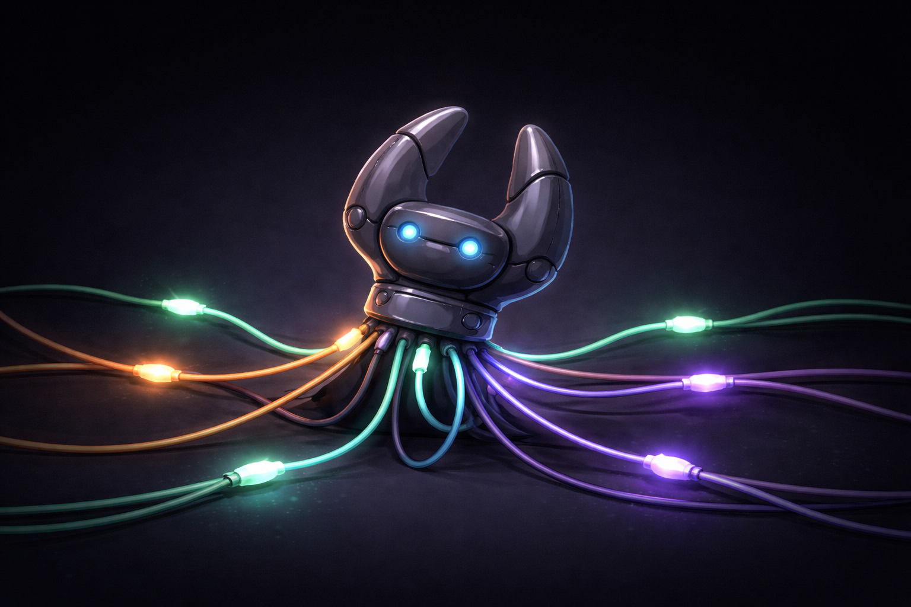

# monoclaw



Personal AI assistant with one continuous session, WebSocket-native multi-channel interaction, minimal codebase for clarity and security.

**codebase:** `2963 lines across 15 files (src/*.py, Dockerfile, pyproject.toml)`

---

- agent turn loop, tool base class + registry, file/shell tools, `CronService` — rewritten in Python based on [NanoClaw](https://github.com/qwibitai/nanoclaw)
- structured memory with hybrid search, tiered compaction — inspired by [free-code](https://github.com/paoloanzn/free-code) and [OpenClaw](https://github.com/openclaw/openclaw)
- massive open-source codebase, unreviewed community contributions, security vulnerabilities nobody can trace — graciously avoided thanks to [OpenClaw](https://github.com/openclaw/openclaw)


## specific features

- **One continuous session per channel** — each channel (as named in its handshake) gets its own history, kept forever (compacted, never reset) in `data/history/<channel>.jsonl`; a new channel starts a new one. Memory and MASTER.md are shared across all channels. Messages sent to a channel with `send_message` are recorded in that channel's history.
- **WebSocket-only protocol** — monoclaw speaks one protocol. Bridges (Signal, Telegram, web UI, etc.) are separate applications that connect over WebSocket and declare their name on handshake.
- **Structured reply with per-turn review** — every LLM call produces a structured `Answer(justification, message, attachments)`, and `message` is auto-delivered to the inbound channel. There is no silent option: every turn the agent is given produces a reply, because the decision of *whether* a message deserves an answer is made upstream by the bridge (direct messages, or group messages that @mention the agent) rather than by the model. An empty `message` is a bug, not a choice, and is rejected. A second LLM pass (the *reviewer*) checks every answer: the `justification` must cite a specific, verifiable source (tool result, memory entry, past message, channel rule, or system prompt / MASTER.md rule), the cited source must genuinely support all message content, and any claimed tool calls must be verifiable in conversation history. On rejection the critique is injected as a user message and the main loop continues — the agent gets a full next iteration with all tools available. After `MAX_NEGATIVE_REVIEWS` (4) consecutive rejections the reply is suppressed, a fallback is delivered, and the full trail is archived. Review trial messages are stripped from session history on completion — only the final accepted answer (or a suppression note) is kept. Fan-out to *other* channels goes through the separate `send_message` tool. The agent can regain its own turn later via `defer_turn` (one-shot self-wakeup); recurring chores stay on the separate `schedule` tool.
- **Structured long-term memory** — typed memories (user/project/reference/feedback/skill) stored as individual Markdown files with SQLite FTS5 index. Hybrid keyword + vector search with temporal decay and MMR diversity re-ranking. Agent searches its own memory via tools.
- **Automatic post-turn extraction** — after each response, the LLM extracts memorable facts and saves them with embeddings. Existing memories are updated, not duplicated. Extraction runs as a background task deferred until foreground is idle, so it never competes with active turns for the LLM server. Rapid bursts coalesce — only the latest task runs (covering all turns). After `_MAX_EXTRACT_CANCELS` consecutive deferrals the cap fires: extraction runs inline before releasing the turn, blocking new messages until complete, guaranteeing no context is lost.
- **Tiered compaction** — microcompact (archive and truncate old tool results) → pre-compaction memory flush → full LLM summary. Fire-and-forget after response delivery.
- **Container-as-deployment isolation** — security comes from container isolation, not application-level sandboxing. The agent process itself runs in Docker; tools operate under `data/workspace/` directly. Single WebSocket entrypoint — extension and security is shifted to proxies managed aside.
- **Minimal core** — auxiliary tools (web search, web fetch, home automation, etc.) are kept out of this repo. They live in [monoclaw-tools](https://github.com/philvec/monoclaw-tools), a companion MCP server that attaches as a sidecar.

---

## Bridge protocol

A bridge connects to monoclaw via WebSocket on port `8765`.

**Handshake** (first message after connect):
```json
{"name": "signal"}
```

**Inbound message** (bridge → monoclaw):
```json
{"text": "Hello!"}
```

Optionally with images — the model is multimodal. `images` may be omitted entirely, so text-only bridges are unaffected. `data` is raw base64 with no `data:` URI prefix:
```json
{"text": "co to jest?", "images": [{"mime": "image/jpeg", "data": "<base64>", "name": "photo.jpg"}]}
```

**Outbound message** (monoclaw → bridge) — a reply arrives as one or more `chunk` frames (streamed token-by-token during auto-delivery, or a single chunk for fan-out) terminated by an `end` frame. A single turn may produce multiple such messages (e.g. mid-turn narration before a tool call, then a final answer):
```json
{"chunk": "He"}
{"chunk": "llo"}
{"end": true}
```

When the agent is about to reply (it may still need to run tools before generating content), it sends one empty chunk right away — bridges can treat any inbound chunk as "typing started":
```json
{"chunk": ""}
```

**Error** (monoclaw → bridge, e.g. bad handshake):
```json
{"error": "channel 'signal' is already connected"}
```

---

## Run

monoclaw runs as a single Docker container. Bridges run separately and connect to it.

**1. Configure** (optional — all fields have defaults; env vars also work via `LLM__BASE_URL` etc.; `MONOCLAW_TOOLS_URL` auto-registers the monoclaw-tools sidecar)

```yaml
llm:
  base_url: http://your-llama-cpp-host:8080/v1
  embeddings_url: http://your-embedding-server:8090/v1  # optional, falls back to base_url
  max_tokens: 4096
  sampling_instruct:            # used when enable_thinking is off; sampling_thinking when on
    temperature: 0.7            # temperature/top_p/top_k/min_p/presence_penalty/repeat_penalty,
    presence_penalty: 1.5       # unset = server default (env: LLM__SAMPLING_INSTRUCT__TEMPERATURE)

tools:
  memory_decay_halflife_days: 30     # older memories rank lower in search
  memory_embedding_weight: 0.6      # vector vs keyword balance (0 = FTS only, 1 = vector only)
  memory_mmr_lambda: 0.7            # relevance vs diversity in results
  memory_consolidation_cron: ""     # e.g. "0 3 * * *" for daily consolidation

mcp:
  - name: tools                  # monoclaw-tools sidecar (github.com/philvec/monoclaw-tools)
    transport: http
    url: http://monoclaw-tools:8766/mcp
  - name: filesystem             # tools exposed as filesystem__<tool_name>
    transport: stdio
    command: npx
    args: ["-y", "@modelcontextprotocol/server-filesystem", "/data/workspace"]
  - name: my-api
    transport: sse
    url: http://my-mcp-server:8000/sse
```

Set `llm.sampling_thinking` and `llm.sampling_instruct` to the model card's values for whichever
model you serve. With llama.cpp, unset fields fall back to its own defaults — at best the one set
baked into the GGUF (usually the thinking-mode one) — for every call, so thinking and non-thinking
calls don't get the sampling the model was tuned for.

**2. Build and run**

```bash
docker build -t monoclaw .
docker run -d \
  -p 8765:8765 \
  -v $(pwd)/config.yaml:/app/config.yaml:ro \
  -v $(pwd)/data:/app/data \
  monoclaw
```

`data/` is the persistent volume — it holds conversation history, memory (Markdown files + SQLite index), cron jobs, archives (compacted history + tool results), and the agent workspace.

---

## Adding a tool

For auxiliary tools (web search, home automation, APIs, etc.), the right place is [monoclaw-tools](https://github.com/philvec/monoclaw-tools) — a companion MCP sidecar that attaches without touching this repo.

For tools that need deep integration with monoclaw internals (session history, compaction, channel management), subclass `Tool`, implement `Params` (Pydantic model) and `execute`, then register in `ToolRegistry.from_config`. The schema is generated automatically and exposed to the LLM.

## Swapping the LLM

`LLMClient` wraps any OpenAI-compatible API. Point `llm.base_url` at any server (Ollama, vLLM, OpenAI, etc.).

For embeddings, set `llm.embeddings_url` to a dedicated embedding server (recommended) or leave empty to use the main LLM endpoint. A dedicated model like Qwen3-Embedding-8B produces better vectors than pooling from a generative model.

**Protip: give the fast classifier (`CLASSIFIER__BASE_URL`) its own small model**, even when the main model is just as fast in tok/s. The fast path is fast because it sends one tiny prompt with no history, not because of tok/s. On a local single-slot server (llama.cpp `-np 1`), sharing the main model means:
- each classifier call evicts the agent's cached prefix, so the next agent call reprocesses the whole history;
- the fast path queues behind a running agent turn.

A dedicated ~4B model (≈5 GB) keeps both caches warm and answers in ~1 s even mid-turn.

See [docs.md](docs.md) for details on the memory system architecture.
